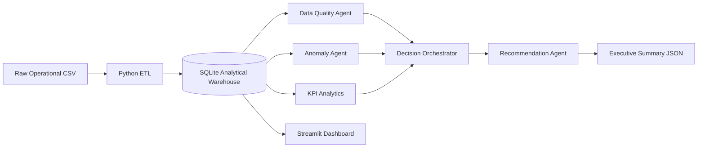

# OpsInsight AI
### Operational Analytics, Data Quality & Agentic Decision Support Platform

OpsInsight AI is a portfolio project built to demonstrate the skills expected from a modern Data Analyst who works across operational analytics, data engineering, automation, testing, visualization, and AI-enabled workflows.

## Business problem

An operations team receives daily transaction/order data from multiple systems. The data contains duplicates, missing values, pricing errors, delayed processing, and unusual revenue patterns. Leaders need a repeatable way to:

- validate incoming data,
- detect operational anomalies,
- understand root causes,
- generate recommendations,
- track KPIs,
- and automate recurring analysis.

OpsInsight AI turns raw operational data into a validated analytical warehouse and produces data-quality findings, anomaly alerts, KPI summaries, and agent-generated recommendations.

|---|---|
| SQL | Star schema, KPI queries, indexes, analytical views |
| Python | Data generation, ETL, quality checks, analytics, agents |
| Data modeling | Fact + dimension analytical model |
| ETL design | Raw CSV -> transformed warehouse tables |
| Data quality | Rule-based validation framework |
| Performance optimization | Indexes, filtered queries, reusable views |
| Reporting / visualization | Streamlit dashboard |
| Automation | Pipeline runner + Airflow DAG |
| Software testing | Pytest unit tests |
| Spark | PySpark transformation example |
| Agentic workflows | Orchestrator + specialist analysis agents |
| Root-cause analysis | Quality + anomaly findings -> recommendations |
| Business communication | Executive summary and dashboard |

## Architecture



## Agentic workflow

The project uses a small, explainable multi-agent architecture:

1. **QualityAgent** reviews validation failures and severity.
2. **AnomalyAgent** analyzes unusual revenue and cycle-time behavior.
3. **KPIAgent** summarizes operational performance.
4. **DecisionOrchestrator** decides which findings need action.
5. **RecommendationAgent** converts findings into prioritized business recommendations.

The agent layer is intentionally deterministic and auditable for interview/demo use. It can later be connected to an LLM provider without changing the analytical pipeline.

## Data model

- `fact_orders`
- `dim_customer`
- `dim_product`
- `dim_region`
- `dq_results`
- `anomaly_results`

## Quick start

```bash
python -m venv .venv
source .venv/bin/activate        # macOS/Linux
# .venv\Scripts\activate         # Windows

pip install -r requirements.txt
python -m src.pipeline
streamlit run app/dashboard.py
```

## Run tests

```bash
pytest -q
```

## Optional Spark example

```bash
spark-submit spark/spark_transform.py
```

## Optional Airflow orchestration

The `airflow/dags/ops_insight_pipeline.py` DAG shows how the recurring operational pipeline can be scheduled as independent tasks.

## Repository structure

```text
OpsInsight_AI/
├── app/
│   └── dashboard.py
├── airflow/
│   └── dags/
│       └── ops_insight_pipeline.py
├── artifacts/
├── data/
│   ├── raw/
│   └── processed/
├── spark/
│   └── spark_transform.py
├── sql/
│   ├── schema.sql
│   └── analytics.sql
├── src/
│   ├── agents.py
│   ├── analytics.py
│   ├── anomaly.py
│   ├── data_quality.py
│   ├── etl.py
│   ├── generate_data.py
│   └── pipeline.py
├── tests/
│   ├── test_agents.py
│   └── test_quality.py
├── INTERVIEW_WALKTHROUGH.md
├── requirements.txt
└── README.md
```

## Interview talking point

> “I built this project to solve an operational analytics problem end to end. I ingest raw transactions, model them for analytics, validate data quality, detect anomalies, and orchestrate specialized analysis agents that turn technical findings into prioritized business recommendations. I also added testing, Airflow orchestration, Spark processing, SQL optimization, and a dashboard so the project reflects both analytical and operational responsibilities.”
